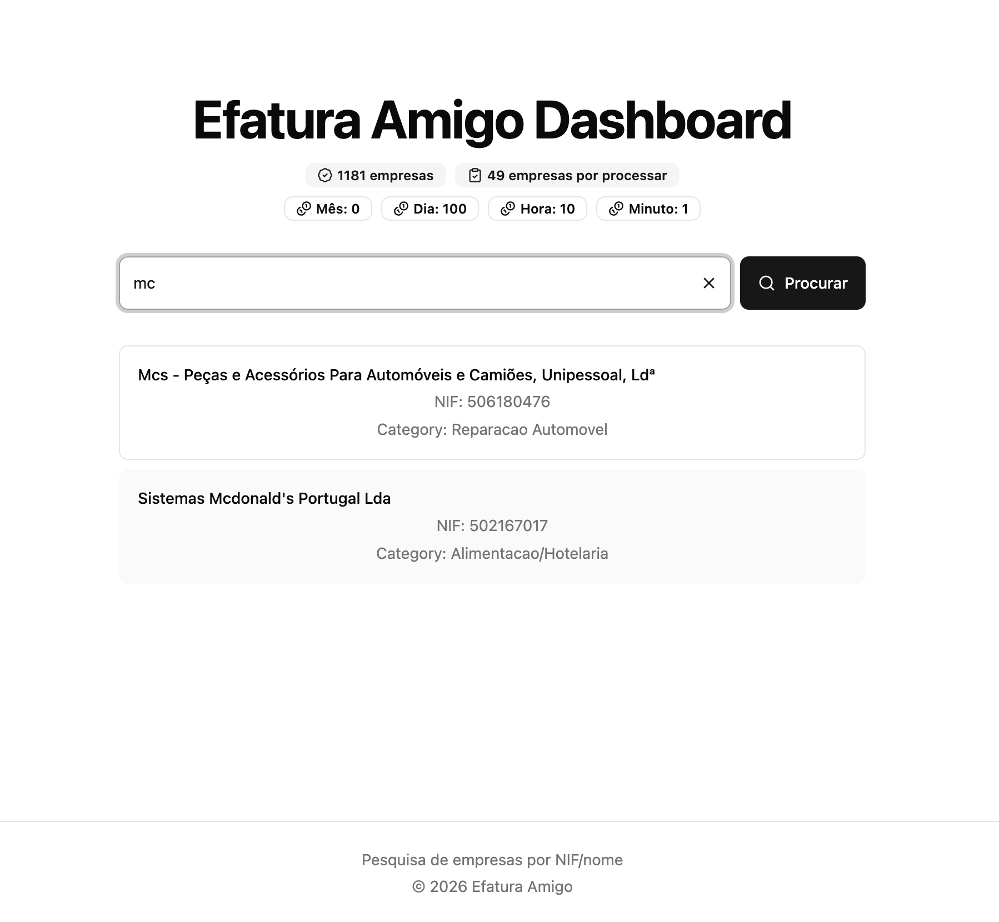

# Efatura Amigo

**Efatura Amigo Dashboard** — a dashboard to search Portuguese companies by NIF, backed by the [Efatura Amigo API](https://github.com/PedroS11/efatura-amigo-be).

## Features

- **Google sign-in** — authenticate with a Google account and store a JWT in `localStorage`
- **Company search** — look up companies by NIF/name with paginated results
- **Metadata overview** — indexed company counts, unprocessed queue size, and NIF.PT API credit usage




## Tech stack

- [React 19](https://react.dev/) + [TypeScript](https://www.typescriptlang.org/)
- [Vite](https://vite.dev/) for dev and build
- [React Router](https://reactrouter.com/) for routing
- [Tailwind CSS 4](https://tailwindcss.com/) + [shadcn/ui](https://ui.shadcn.com/) components
- [@react-oauth/google](https://www.npmjs.com/package/@react-oauth/google) for authentication
- [ESLint](https://eslint.org/) + [Prettier](https://prettier.io/) for linting and formatting

## Prerequisites

- Node.js 22+
- Yarn (or npm)
- A Google OAuth client ID
- Access to the Efatura Amigo API

## Getting started

### 1. Install dependencies

```bash
yarn install
```

### 2. Configure environment variables

Create a `.env.local` file in the project root:

```env
VITE_GOOGLE_CLIENT_ID=your-google-client-id.apps.googleusercontent.com
VITE_API_URL=__VITE_API_URL__
```

| Variable | Description |
| --- | --- |
| `VITE_GOOGLE_CLIENT_ID` | Google OAuth 2.0 client ID for the sign-in button |
| `VITE_API_URL` | Base URL of the Efatura Amigo API |

### 3. Run the dev server

```bash
yarn dev
```

Open the URL shown in the terminal (usually `http://localhost:5173`).

## Scripts

| Command | Description |
| --- | --- |
| `yarn dev` | Start the Vite dev server |
| `yarn build` | Type-check and build for production |
| `yarn preview` | Preview the production build locally |
| `yarn lint` | Run ESLint |
| `yarn lint:fix` | Run ESLint with auto-fix |
| `yarn format` | Format the codebase with Prettier |
| `yarn format:check` | Check formatting without writing files |

## Project structure

```
src/
├── main.tsx              # App entry, routing, providers
├── Login.tsx             # Google sign-in page
├── Dashboard.tsx         # Search UI, metadata, results
├── Footer.tsx
├── components/ui/        # shadcn/ui components
└── lib/
    ├── api/
    │   ├── apiFetch.ts   # Authenticated fetch wrapper
    │   ├── getMetadata.ts
    │   └── searchCompanies.ts
    └── utils.ts
```

## API

All requests send `Authorization: Bearer <idToken>` using the Google credential stored at login.

| Endpoint | Used for |
| --- | --- |
| `GET /api/metadata` | Dashboard stats (company counts, NIF.PT credits) |
| `GET /api/search?query=&page=` | Paginated company search |

On `401` or `403`, the app shows a session-expired message and redirects to `/`.

## Deploy to Cloudflare

Deployed via **Cloudflare Workers CI/CD** (Git integration). One worker serves the dashboard and proxies `/api/*` to your API gateway.

| Route | Behavior |
| --- | --- |
| `x.dev/` | React dashboard (SPA) |
| `x.dev/api/*` | Proxied to `EFATURA_API_BASE_URL` |

### One-time setup in the Cloudflare dashboard

Connect this repo under **Workers & Pages → Create → Connect to Git**, then configure:

| Setting | Value |
| --- | --- |
| Build command | `yarn build` |
| Deploy command | `npx wrangler deploy` |
| **Build** variable `VITE_GOOGLE_CLIENT_ID` | Your Google OAuth client ID |
| **Build** variable `VITE_API_URL` | *(leave empty)* |
| **Worker** variable `EFATURA_API_BASE_URL` | Your API gateway URL (e.g. `https://api.example.com`) |

Set `EFATURA_API_BASE_URL` as a **plain text Worker variable** under **Settings → Variables and Secrets** (not a build variable). Plain text is fine — it is just a URL, not a credential.

`wrangler.toml` sets `keep_vars = true` so CI deploys do not delete dashboard Worker variables. Without this, `npx wrangler deploy` treats the repo config as source of truth and removes vars that exist only in the dashboard.

After adding the variable, push this change (or retry the latest deployment), then set `EFATURA_API_BASE_URL` again in the dashboard if a previous deploy already removed it.

Then attach your custom domain under **Settings → Domains & Routes**.

Add your production origin (e.g. `https://x.dev`) to authorized JavaScript origins in the [Google Cloud Console](https://console.cloud.google.com/apis/credentials).

Pushes to the connected branch deploy automatically.
